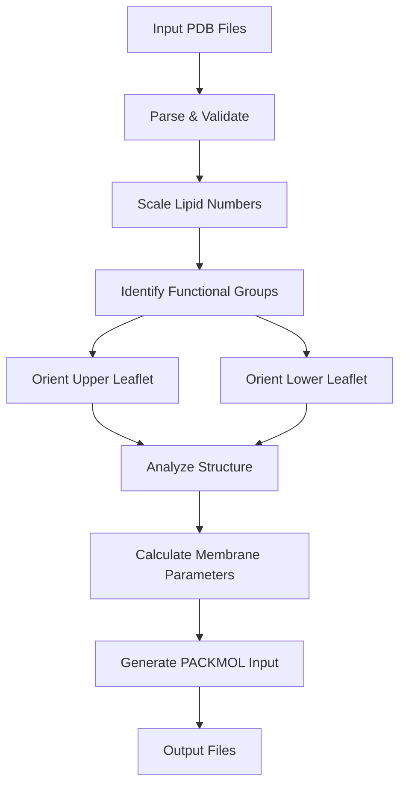

# AllAtom_Membrane_Building
Script generated by Billy Noonan (AIBN) to build all atom membranes without the MemGen webserver.

# genPackMol.py - Interdigitated Membrane Builder


A high-performance Python script for generating PACKMOL input files to build realistic interdigitated lipid membranes. This tool is specifically designed for phospholipids and glycolipids generated with the Automated Topology Builder (ATB).

## 🚀 Quick Start

```bash
# Basic usage
python3 genPackMol.py --pdb lipid1.pdb lipid2.pdb --numbers 35 17 --apl 75 --target_total 52

# Complex membrane with four lipid types
python3 genPackMol.py --pdb oriented_02_S5PG.pdb oriented_02_S5LG.pdb oriented_02_S5DG.pdb oriented_02_S5CL.pdb \
                     --numbers 56 12 19 13 --apl 70 --target_total 52
```

## 📋 Complete Workflow

### Step 1: Prepare Lipid Structures
Use `align_lipids.py` to pre-orient your ATB-generated lipid structures:
```bash
python3 align_lipids.py input_lipid.pdb
```

### Step 2: Generate Membrane
Run `genPackMol.py` with your aligned structures:
```bash
python3 genPackMol.py --pdb aligned_lipid1.pdb aligned_lipid2.pdb \
                     --numbers 40 10 --apl 70 --target_total 50
```

### Step 3: Build Membrane with PACKMOL
Execute the generated PACKMOL input:
```bash
packmol < PackMol.inp
```

**Timeline:**
- ⚡ **Initial membrane**: ~30 minutes
- 🎯 **Optimized membrane**: ~12 hours

## 🎛️ Command-Line Flags

| Flag | Type | Required | Description |
|------|------|----------|-------------|
| `--pdb` | list | ✅ | Input PDB files (space-separated) |
| `--numbers` | list[int] | ✅ | Number of each lipid type (will be scaled to target) |
| `--apl` | float | ❌ | Area per lipid in Ų (default: 75) |
| `--target_total` | int | ❌ | Target lipids per leaflet (default: 525) |

### Flag Details

- **`--pdb`**: PDB files of individual lipid molecules from ATB
- **`--numbers`**: Initial lipid counts - automatically scaled to achieve `target_total`
- **`--apl`**: Controls membrane density (70-80 Ų typical for biological membranes)
- **`--target_total`**: Total lipids per leaflet in final membrane

## 🧠 Code Logic & Workflow

### Core Architecture



### 1. **Lipid Identification & Functional Groups**
- Automatically detects lipid type (S5PG, S5LG, S5DG, S5CL) from filename
- Identifies headgroup, glycerol, and tail atoms using ATB naming conventions
- Uses hardcoded atom name mappings for each lipid type

### 2. **Orientation Algorithm**
- **Upper Leaflet**: Headgroups point UP (+Z), tails DOWN (-Z)
- **Lower Leaflet**: Headgroups point DOWN (-Z), tails UP (+Z)
- Uses Rodrigues' rotation formula for precise 3D orientation
- Centers rotation around glycerol backbone for stability

### 3. **Membrane Parameter Calculation**
- Calculates optimal box dimensions from area per lipid
- Sets headgroup separation distance (35 Å for fast convergence)
- Creates controlled interdigitation zones between leaflets

### 4. **PACKMOL Optimization Strategy**
```python
# Speed-optimized parameters
tolerance 5.0          # Forgiving for complex systems
nloop 30              # Reduced optimization cycles
maxit 300             # Reduced iterations per cycle
constrain_rotation    # Tight rotational constraints
```

## ⚡ Performance Optimization

### Current Speed Features
- **Reduced iterations**: `nloop 30`, `maxit 300` (vs typical 50/500)
- **Tight constraints**: Limited rotation ranges for faster convergence
- **Optimized tolerance**: 5.0 Å balance between speed and quality
- **Streamlined I/O**: Minimal file operations and memory usage
- **Smart positioning**: Pre-calculated Z-constraints reduce search space

### To Make It Even Faster

#### 1. Reduce Iterations Further
```python
# In generate_packmol_input()
f.write("nloop 20\n")        # From 30
f.write("maxit 200\n")       # From 300
```

#### 2. Increase Tolerance
```python
f.write("tolerance 6.0\n")   # From 5.0
```

#### 3. Simplify Constraints
```python
# Remove center of mass constraints
# Comment out: f.write("centerofmass\n")
```

#### 4. Reduce System Size
```python
# Use smaller target_total for testing
--target_total 25  # Instead of 525
```

#### 5. Adjust Box Dimensions
```python
# In calculate_membrane_parameters()
headgroup_separation = 30.0  # From 35.0 (tighter packing)
total_z = headgroup_separation + max_total_span + 10.0  # From 15.0
```

## 🧪 Supported Lipids (ATB Only)

This script **only works** with phospholipids and glycolipids generated using the Automated Topology Builder (ATB):

### Supported Types
- **S5PG**: Phosphatidylglycerol
- **S5LG**: Lysylphosphatidylglycerol  
- **S5DG**: Digalactosyldiacylglycerol
- **S5CL**: Cardiolipin

### ATB Requirements
- Uses ATB-specific atom naming conventions
- Requires ATB-generated topology and coordinates
- Hardcoded functional group identification based on ATB numbering

## 🆚 Advantages Over WebGen/Other Tools

### 1. **Realistic Lipid Conformations**
- **genPackMol**: Preserves natural lipid curvature and flexibility
- **WebGen**: Often straightens lipids, creating artificial rod-like structures

### 2. **True Interdigitation**
- Creates proper leaflet overlap with controlled interdigitation depth
- Maintains realistic headgroup-headgroup distances

### 3. **ATB Integration**
- Direct compatibility with ATB force field parameters
- No manual topology conversion required

### 4. **Speed Optimization**
- Generates usable membranes in ~30 minutes
- Fully optimized systems in ~12 hours
- Pre-optimized PACKMOL parameters

### 5. **Biological Realism**
- Maintains lipid tail flexibility
- Preserves headgroup hydration shells
- Creates realistic membrane thickness variations

## 📁 Output Files

```
upper_lipid1.pdb      # Upper leaflet oriented structures
lower_lipid1.pdb      # Lower leaflet oriented structures  
upper_lipid2.pdb
lower_lipid2.pdb
PackMol.inp           # PACKMOL input file
membrane.pdb          # Final membrane (after running PACKMOL)
```

## 🔧 Troubleshooting

### Common Issues

**PACKMOL fails to converge:**
- Increase `tolerance` to 6.0-8.0
- Increase `nloop` to 50-100
- Reduce `target_total` for testing

**Overlapping atoms in input:**
- Use `align_lipids.py` to pre-process structures
- Check individual PDB files for internal overlaps
- Consider energy minimization of input structures

**Memory issues:**
- Reduce `target_total`
- Process lipids in smaller batches
- Use smaller box dimensions

## 📖 Example Session

```bash
# 1. Prepare lipids (if needed)
python3 align_lipids.py 02_S5PG.pdb
python3 align_lipids.py 02_S5LG.pdb

# 2. Generate membrane
python3 genPackMol.py --pdb aligned_02_S5PG.pdb aligned_02_S5LG.pdb \
                     --numbers 40 10 --apl 70 --target_total 50

# 3. Build with PACKMOL
packmol < PackMol.inp

# Output: membrane.pdb (ready for MD simulation)
```

## 📚 References

- **ATB**: [Automated Topology Builder](https://atb.uq.edu.au/)
- **PACKMOL**: [Molecular Packing Tool](http://leandro.iqm.unicamp.br/m3g/packmol/)
- **Interdigitated Membranes**: Specialized lipid arrangements found in extremophiles

## 📄 License

MIT License - See LICENSE file for details.

---
*Built for realistic membrane simulations with ATB force fields*
